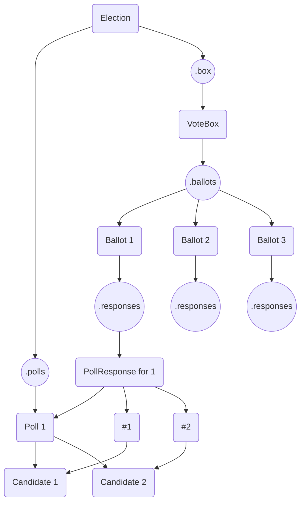

# jstv -- JavaScript STV Implementation

JSTV is a Node.js implementation of [Single Transferrable Vote](https://en.wikipedia.org/wiki/Single_transferable_vote) using random selections for transfers.

Debugging output is enabled by setting `DEBUG` as an environment variable, to any value like `DEBUG="jstv jstv:*"`.

This package is seriously work-in-progress.

## Polling Infrastructure

The primary parent class `Election` contains many sub-classes to represent different components.

An `Election` contains instances of `Poll`s. `Poll`s contain `Candidate`s.

The `Election` class also contains ONE instance of a `VoteBox` which contains different `Ballot`s. The `Ballot`s contain `PollResponse`s which contain `CandidatePriority`s.

Represented in a tree as follows:

